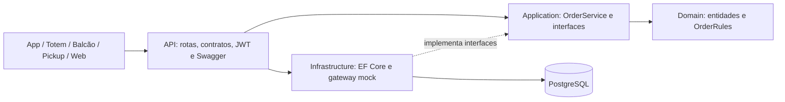
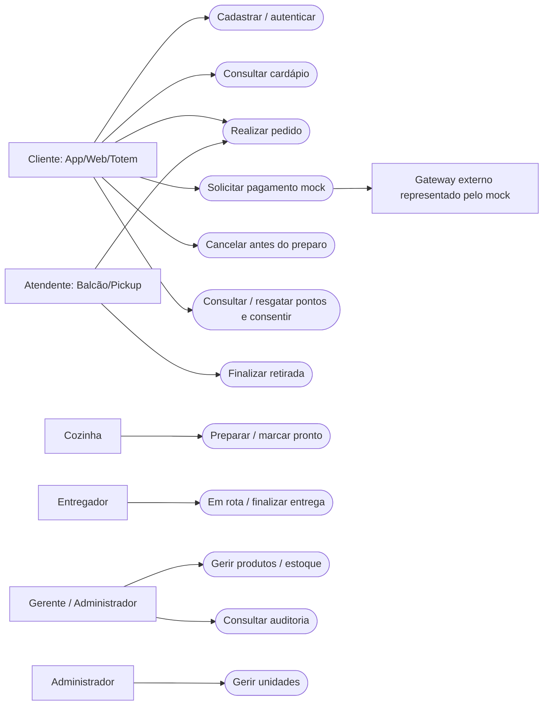
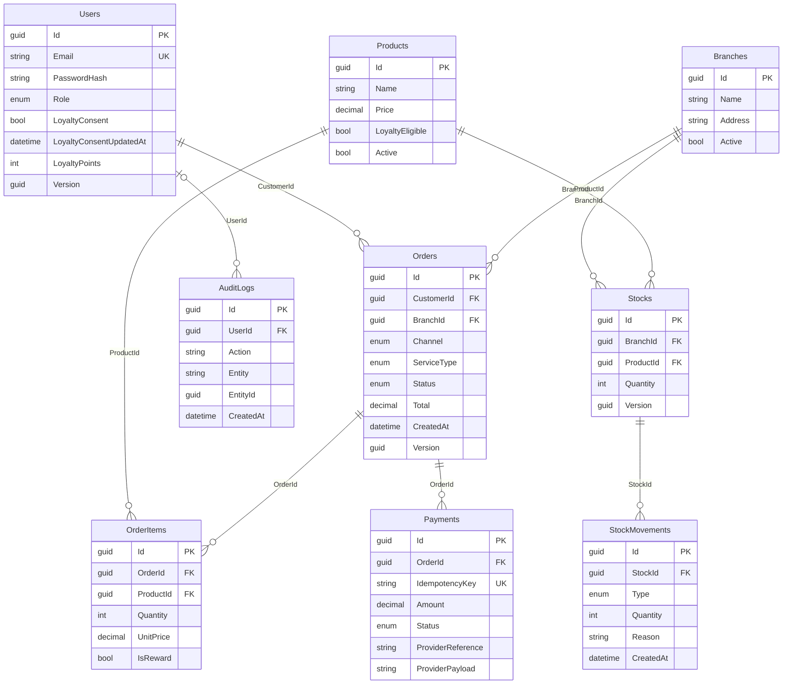
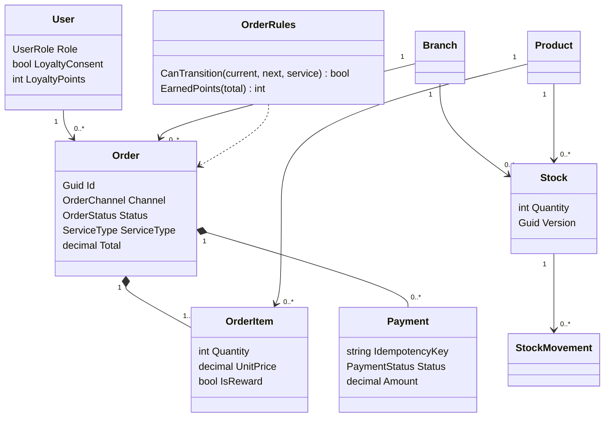

# Requisitos, arquitetura e modelagem

## Contexto e prioridade

A rede precisa consolidar pedidos de APP, TOTEM, BALCAO, PICKUP e WEB, respeitando o estoque de cada unidade. O MVP prioriza um fluxo de pedido íntegro e testável, sem cobrança financeira real.

| ID | Requisito | Implementação/prioridade |
|---|---|---|
| RF01 | Cadastrar e autenticar clientes | Login JWT e hash de senha; alta |
| RF02 | Diferenciar perfis operacionais | Cliente, Atendente, Cozinha, Entregador, Gerente, Administrador; alta |
| RF03 | Consultar cardápio por unidade | Produtos ativos com saldo disponível na unidade; alta |
| RF04 | Criar e consultar pedido multicanal | Canal obrigatório, itens, preços do banco, tipo de atendimento; alta |
| RF05 | Processar pagamento mock | Aprovação, recusa, indisponibilidade e idempotência; alta |
| RF06 | Atualizar/cancelar pedido | Transições válidas por atendimento; cancelamento antes do preparo; alta |
| RF07 | Movimentar estoque | Entradas, saídas manuais/na aprovação, histórico e estorno; alta |
| RF08 | Fidelizar com consentimento | Pontos, resgate e revogação de consentimento; média |
| RF09 | Promoções/campanhas | Proposta: desconto por unidade/canal, janela temporal e limite; não implementado |
| RF10 | Gestão completa da rede | Cadastro/consulta/edição/desativação de unidades e produtos; vínculo de funcionários à unidade fica proposto |

| ID | Requisito não funcional | Abordagem e limitação |
|---|---|---|
| RNF01 | Integridade | Transação serializável; concorrência otimista em User, Stock e Order; FKs e unicidade |
| RNF02 | Segurança | JWT, perfis, minimização de dados e erros sem stack trace; não é certificação de segurança |
| RNF03 | Rastreabilidade | Canal persistido e AuditLogs para ações sensíveis |
| RNF04 | Reprodutibilidade | .NET 10, seed, PostgreSQL local, Docker opcional, coleção e testes |
| RNF05 | Desempenho | Paginação e índices; sem benchmark ou garantia de capacidade em pico |
| RNF06 | Disponibilidade | Endpoint /health, banco persistente e falha mock controlada; sem SLA de disponibilidade |
| RNF07 | Evolução | Camadas e serviços; migration PostgreSQL versionada |

## Camadas



`OrderService` orquestra criação, pagamento, estoque, transições, cancelamento e pontos. `IAppDbContext` abstrai a unidade de trabalho; expõe DbSet, portanto a camada Application ainda conhece EF Core. É uma separação pragmática, não uma implementação estrita de Clean Architecture. Cadastros simples permanecem nos controllers. `MockPaymentGateway` implementa `IPaymentGateway` e representa um provedor externo sem dependência de rede.

## Atores e casos de uso

O diagrama abaixo apresenta a visão de atores/funcionalidades; a versão UML está em `casos-de-uso.png` e no relatório. Os canais representam a origem do pedido, não diferentes formas de autenticação.



### Feature crítica: realizar pedido e pagar

**Pré-condições:** usuário autenticado; unidade e produtos ativos; quantidades válidas; estoque suficiente. Se houver resgate: consentimento e pontos suficientes. Pedido de entrega deve ter endereço.

**Fluxo principal:** API valida contrato e canal → carrega produtos e calcula total → verifica estoque agregado → reserva pontos de resgate → salva pedido e auditoria → usuário solicita mock com chave única → aprovação verifica novamente e baixa estoque → salva pagamento, payload e status Aceito atomicamente → cozinha prepara e marca pronto → atendente/entregador finaliza → credita pontos uma única vez se houver consentimento.

**Pós-condições:** pedido finalizado, pagamentos registrados, estoque atualizado, pontos consistentes e trilha de auditoria consultável.

**Exceções:** contrato inválido 400/422; ausência de token 401; falta de permissão 403; unidade/produto/pedido inexistente 404; estoque insuficiente, chave reutilizada com outro payload ou transição inválida 409. Recusa do mock é resultado de negócio HTTP 200 com `status=Recusado`; indisponibilidade simulada é HTTP 503. O consumidor pode repetir a operação após consultar o estado; a idempotência evita duplicação de pagamento.

```mermaid
sequenceDiagram
    actor C as Cliente
    participant API
    participant S as OrderService
    participant G as MockPaymentGateway
    participant DB as Banco relacional
    C->>API: POST /pedidos + canalPedido
    API->>S: Criar pedido validado
    S->>DB: Validar estoque e persistir pedido/auditoria
    DB-->>C: 201 AguardandoPagamento
    C->>API: POST /pedidos/{id}/pagamentos
    API->>S: Usuário, chave, resultado simulado
    S->>DB: Validar acesso e idempotência
    S->>G: Pedido, valor, approve
    G-->>S: Status, referência, payload
    alt Aprovado
        S->>DB: Transação: baixar estoque + pagamento + Aceito + auditoria
    else Recusado
        S->>DB: Registrar recusa; manter AguardandoPagamento
    end
    S-->>C: 200 resultado mock
```

## DER

Imagem: [der.svg](der.svg). O modelo contém nove tabelas; IDs são GUIDs. Valores monetários são decimal, com precisão (12,2) no PostgreSQL. Datas são geradas em UTC.



Restrições: e-mail e chave de idempotência únicos; par (BranchId, ProductId) único; saldos de estoque e pontos não negativos; pedidos vinculados a usuário/unidade; itens a pedido/produto; pagamentos a pedido; movimentos a estoque. `AuditLogs.EntityId` é uma referência lógica polimórfica, **não** FK; `UserId` é FK opcional. `Channel` é exposto como `canalPedido` no JSON. Um pedido deve ter ao menos um item na aplicação; essa cardinalidade mínima não é uma restrição do banco.

## Classes de domínio

Figuras complementares: [classes.png](classes.png), [casos-de-uso.png](casos-de-uso.png) e [sequencia.png](sequencia.png). As figuras resumem o modelo; atributos completos e restrições estão nas entidades e migrations.



## Proposta de campanhas (não implementada)

Campanha teria unidade/canais elegíveis, início/fim em UTC, desconto percentual limitado e flag ativa. Aplicação verificaria vigência e elegibilidade antes de calcular total; guardaria no pedido o desconto aplicado, sem recalcular pedidos antigos. Não acumularia desconto de campanha com item gratuito da fidelidade. Uma futura implementação precisaria de tabela, migrations, testes de limites e documentação de novos contratos.
